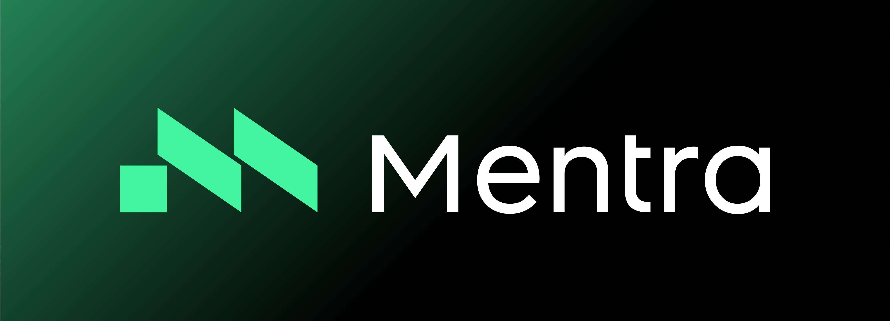

  
  
  <h3>The open source operating system for smart glasses</h3>
  
  

    <a href="https://mentra.glass">Website</a> •
    <a href="https://docs.mentra.glass">Documentation</a> •
    <a href="https://console.mentra.glass">Developer Console</a> •
    <a href="https://apps.mentra.glass">Mentra Store</a>
  

  <h2>Get MentraOS</h2>
  
  
  

## 👓 About Mentra

MentraOS is the open source operating system for smart glasses. We believe in building technology that empowers users while respecting their privacy and freedom.

## 🔗 Quick Links

- **[Website](https://mentra.glass)** - Learn more about Mentra
- **[Documentation](https://docs.mentra.glass)** - Get started with MentraOS development
- **[Developer Console](https://console.mentra.glass)** - Manage your apps and deployments
- **[Mentra Store](https://apps.mentra.glass)** - Discover apps for your smart glasses

## 📞 Contact

Have questions or ideas? We'd love to hear from you!

- **Email**: [team@mentra.glass](mailto:team@mentra.glass)
- **Discord**: [Join our community](http://mentra.glass/discord)
- **Twitter**: [Follow @mentralabs](https://x.com/mentralabs)

## 🤝 Contributing

We welcome contributions from the community! Check out our repositories to get started:

- Read our [Contributing Guide](https://docs.mentra.glass/contributing/)
- Report bugs and request features through GitHub Issues
- Submit pull requests with improvements
- Join our developer community

---

  <h3>© 2025 Mentra Labs</h3>

